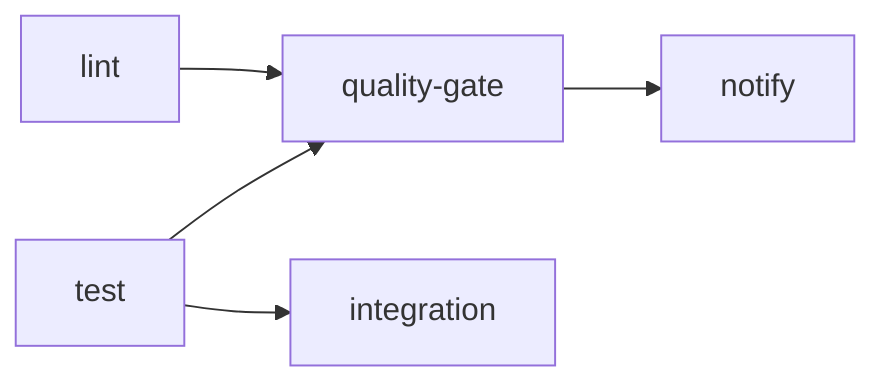

# CI/CD Quick Start Guide

This guide covers the GitHub Actions CI/CD pipeline for the Juniper Cascor project.

## Pipeline Overview

The pipeline consists of 5 stages defined in `.github/workflows/ci.yml`:



| Stage | Description | Runs On |
|-------|-------------|---------|
| **lint** | Black, isort, flake8, mypy checks | All pushes and PRs |
| **test** | Unit tests with coverage (excludes slow tests) | All pushes and PRs |
| **integration** | Integration tests (excludes slow tests) | PRs only |
| **quality-gate** | Aggregates lint + test results | All pushes and PRs |
| **notify** | Reports final build status | All pushes and PRs |

### Job Dependencies

- `integration` depends on `test` (only runs after test passes)
- `quality-gate` depends on both `lint` and `test`
- `notify` depends on `quality-gate`

## Triggering CI

### Automatic Triggers

| Event | Branches |
|-------|----------|
| **Push** | `main`, `develop`, `feature/**`, `fix/**` |
| **Pull Request** | `main`, `develop` |

### Manual Dispatch

The workflow does not currently have `workflow_dispatch` enabled. To trigger manually, push a commit or open a PR to a monitored branch.

## Checking Results

### Finding Workflow Runs

1. Go to the repository on GitHub
2. Click the **Actions** tab
3. Select **CI/CD Pipeline** from the left sidebar
4. Click on a specific workflow run to see details

### Understanding Pass/Fail Status

| Icon | Meaning |
|------|---------|
| ✅ Green check | All jobs passed |
| ❌ Red X | One or more jobs failed |
| 🟡 Yellow dot | Workflow in progress |
| ⚪ Gray circle | Job skipped or cancelled |

**Note**: Lint jobs use `continue-on-error: true`, so lint failures appear as warnings but don't fail the pipeline. Test failures will fail the quality gate.

### Viewing Artifacts

Artifacts are retained for 30 days:

1. Open the workflow run
2. Scroll to the **Artifacts** section
3. Download:
   - `coverage-report-3.14` - Coverage XML and HTML reports
   - `test-results-3.14` - JUnit XML test results

The HTML coverage report is at `htmlcov/index.html` inside the artifact.

## Reproducing CI Locally

Run the same checks locally before pushing:

### Lint Checks

```bash
cd src

# Format check (Black)
python -m black --check --diff .

# Import sort check (isort)
python -m isort --check-only --diff .

# Linting (flake8)
python -m flake8 . \
    --max-line-length=512 \
    --extend-ignore=E203,E266,E501,W503 \
    --max-complexity=15

# Type checking (mypy)
python -m mypy cascade_correlation/ candidate_unit/ --ignore-missing-imports
```

### Tests

```bash
cd src/tests

# Run unit tests (same as CI - excludes slow tests)
python -m pytest unit/ -v -m "unit and not slow" --timeout=60

# Run with coverage
python -m pytest unit/ -v \
    -m "unit and not slow" \
    --cov=../cascade_correlation \
    --cov=../candidate_unit \
    --cov-report=term-missing

# Run integration tests (PR behavior)
python -m pytest integration/ -v -m "integration and not slow" --timeout=120
```

### Full Local CI Simulation

```bash
# Install linting tools
pip install black isort mypy flake8 flake8-bugbear flake8-comprehensions flake8-simplify

# Install test tools
pip install pytest pytest-cov pytest-timeout pytest-xdist

# Run all checks
cd src
black --check --diff .
isort --check-only --diff .
flake8 . --max-line-length=512 --extend-ignore=E203,E266,E501,W503
mypy cascade_correlation/ candidate_unit/ --ignore-missing-imports

cd tests
python -m pytest unit/ -v -m "unit and not slow" --timeout=60
```

## Quick Fixes for Common Failures

### Lint Failures

**Black formatting issues:**

```bash
cd src
python -m black .  # Auto-fix formatting
```

**isort import order issues:**

```bash
cd src
python -m isort .  # Auto-fix import order
```

**Flake8 errors:**

- Review the specific error codes in the output
- Common ignores already configured: `E203`, `E266`, `E501`, `W503`
- Max line length is 512 characters

**MyPy type errors:**

- Add type hints or fix type inconsistencies
- `--ignore-missing-imports` is already set for third-party libraries

### Test Failures

1. **Read the failure output** - pytest shows the assertion that failed
2. **Run the specific failing test locally:**

   ```bash
   cd src/tests
   python -m pytest unit/test_file.py::test_name -v
   ```

3. **Check for environment differences** - CI uses conda with `conf/conda_environment.yaml`

### Timeout Issues

Default timeouts:

- Unit tests: 60 seconds per test
- Integration tests: 120 seconds per test

If a test times out:

1. Check if the test is marked with `@pytest.mark.slow` - slow tests are excluded from CI
2. Consider optimizing the test or adding the `slow` marker
3. Slow tests should be run locally:

   ```bash
   python -m pytest -m "slow" --timeout=300
   ```

### Coverage Below Threshold

The pipeline warns (soft fail) if coverage drops below 50%:

```bash
# Check coverage locally
cd src/tests
python -m coverage report --fail-under=50
```

## Environment Details

| Setting | Value |
|---------|-------|
| Python Version | 3.14 |
| Package Manager | mamba (via conda-incubator/setup-miniconda@v3) |
| Environment File | `conf/conda_environment.yaml` |
| Coverage Threshold | 50% (soft fail) |
| Test Timeout | 60s (unit), 120s (integration) |
