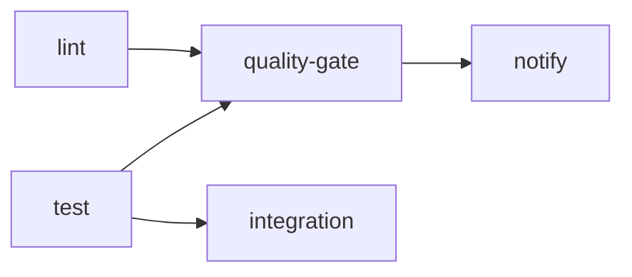

# CI/CD Quick Start Guide

This guide covers the GitHub Actions CI/CD pipeline for the Juniper Cascor project.

## Pipeline Overview

The pipeline consists of 5 stages defined in `.github/workflows/ci.yml`:



| Stage | Description | Runs On |
|-------|-------------|---------|
| **lint** | Black, isort, flake8, mypy checks | All pushes and PRs |
| **test** | Unit tests with coverage (excludes slow tests) | All pushes and PRs |
| **integration** | Integration tests (excludes slow tests) | PRs only |
| **quality-gate** | Aggregates lint + test results | All pushes and PRs |
| **notify** | Reports final build status | All pushes and PRs |

### Job Dependencies

- `integration` depends on `test` (only runs after test passes)
- `quality-gate` depends on both `lint` and `test`
- `notify` depends on `quality-gate`

## Triggering CI

### Automatic Triggers

| Event | Branches |
|-------|----------|
| **Push** | `main`, `develop`, `feature/**`, `fix/**` |
| **Pull Request** | `main`, `develop` |

### Manual Dispatch

The workflow does not currently have `workflow_dispatch` enabled. To trigger manually, push a commit or open a PR to a monitored branch.

## Dependabot Lockfile Updates

`.github/workflows/lockfile-update.yml` regenerates `requirements.lock` on Dependabot `dependabot/pip/**` pushes (and on same-repo PRs that touch `pyproject.toml`).

| PAT (`CROSS_REPO_DISPATCH_TOKEN`) | Behavior |
|-----------------------------------|----------|
| Available to the run | Auto-regen + push (`[dependabot skip]`) so CI re-triggers |
| Missing on Dependabot runs | **Green no-op** — regenerate locally or register the PAT under **Settings → Secrets → Dependabot** |
| Missing on non-Dependabot runs | Hard fail (secret misconfiguration) |

CI job **Lockfile Freshness** still blocks merge when the lock no longer satisfies `pyproject.toml`, even if auto-regen no-ops.

```bash
# Local regen (same extras as the workflow)
uv pip compile pyproject.toml \
  --extra ml --extra api --extra observability --extra juniper-data \
  --index-strategy unsafe-best-match --no-emit-package torch \
  --upgrade -o requirements.lock
```

> Details: [CI Manual — Lockfile Update](MANUAL.md#lockfile-update-workflow) | [Dependency Update Workflow](../../notes/DEPENDENCY_UPDATE_WORKFLOW.md)

## Checking Results

### Finding Workflow Runs

1. Go to the repository on GitHub
2. Click the **Actions** tab
3. Select **CI/CD Pipeline** from the left sidebar
4. Click on a specific workflow run to see details

### Understanding Pass/Fail Status

| Icon | Meaning |
|------|---------|
| ✅ Green check | All jobs passed |
| ❌ Red X | One or more jobs failed |
| 🟡 Yellow dot | Workflow in progress |
| ⚪ Gray circle | Job skipped or cancelled |

**Note**: Pre-commit, unit-test, integration-test, and security jobs are enforced by their dedicated workflow steps. Treat any failed required status check as blocking until the underlying job is fixed.

### Viewing Artifacts

Artifacts are retained for 30 days:

1. Open the workflow run
2. Scroll to the **Artifacts** section
3. Download:
   - `coverage-report-3.14` - Coverage XML and HTML reports
   - `test-results-3.14` - JUnit XML test results

The HTML coverage report is at `htmlcov/index.html` inside the artifact.

## Reproducing CI Locally

Run the same checks locally before pushing:

### Lint Checks

```bash
cd src

# Format check (Black)
python -m black --check --diff .

# Import sort check (isort)
python -m isort --check-only --diff .

# Linting (flake8)
python -m flake8 . \
    --max-line-length=512 \
    --extend-ignore=E203,E266,E501,W503 \
    --max-complexity=15

# Type checking (mypy)
python -m mypy cascade_correlation/ candidate_unit/ --ignore-missing-imports
```

### Tests

```bash
# Run from the repository root

# Run unit tests (same as CI - excludes slow tests)
python -m pytest src/tests/unit -v -m "unit and not slow" --timeout=60

# Run with coverage
python -m pytest \
    -m "unit and not slow" \
    src/tests/unit \
    --verbose \
    --timeout=60 \
    --cov=src \
    --cov-report=term-missing

# Run integration tests (PR behavior)
python -m pytest src/tests/integration -v -m "integration and not slow" --timeout=120
```

### Full Local CI Simulation

```bash
# Install linting tools
pip install black isort mypy flake8 flake8-bugbear flake8-comprehensions flake8-simplify

# Install test tools
pip install pytest pytest-cov pytest-timeout pytest-xdist

# Run all checks
cd src
black --check --diff .
isort --check-only --diff .
flake8 . --max-line-length=512 --extend-ignore=E203,E266,E501,W503
mypy cascade_correlation/ candidate_unit/ --ignore-missing-imports

cd tests
python -m pytest unit/ -v -m "unit and not slow" --timeout=60
```

## Quick Fixes for Common Failures

### Lint Failures

**Black formatting issues:**

```bash
cd src
python -m black .  # Auto-fix formatting
```

**isort import order issues:**

```bash
cd src
python -m isort .  # Auto-fix import order
```

**Flake8 errors:**

- Review the specific error codes in the output
- Common ignores already configured: `E203`, `E266`, `E501`, `W503`
- Max line length is 512 characters

**MyPy type errors:**

- Add type hints or fix type inconsistencies
- `--ignore-missing-imports` is already set for third-party libraries

### Test Failures

1. **Read the failure output** - pytest shows the assertion that failed
2. **Run the specific failing test locally:**

   ```bash
   cd src/tests
   python -m pytest unit/test_file.py::test_name -v
   ```

3. **Check for environment differences** - CI uses conda with `conf/conda_environment.yaml`

### Timeout Issues

Default timeouts:

- Unit tests: 60 seconds per test
- Integration tests: 120 seconds per test

If a test times out:

1. Check if the test is marked with `@pytest.mark.slow` - slow tests are excluded from CI
2. Consider optimizing the test or adding the `slow` marker
3. Slow tests should be run locally:

   ```bash
   python -m pytest -m "slow" --timeout=300
   ```

### Coverage Below Threshold

The unit-tests job fails if aggregate coverage drops below the configured 80% gate:

```bash
# Check coverage locally from the repository root
bash util/run_coverage.bash
```

## WS-6 Gates (Golden + Conformance)

Two dedicated serial workflows sit beside `ci.yml`. They are **not** part of the
unit/integration coverage lane — collection requires explicit opt-in flags so
they never leak into xdist or scheduled-slow runs.

| Workflow | File | Asserts | Calibration pins |
|----------|------|---------|------------------|
| Golden Regression (WS-6 Gate) | `.github/workflows/golden-regression.yml` | Float/structure goldens (OUT-12) | Python **3.13**, torch **2.11.0** CPU |
| Conformance (WS-6 Gate) | `.github/workflows/conformance.yml` | `GrowableModel` interface contract (OUT-13) | Same pins |

Triggers: `push` to `main`, PRs to `main`/`develop`, and `workflow_dispatch`.

### Reproduce locally (GIL env, serial only)

```bash
# From repo root on JuniperCascor1 (GIL). Never add -n / pytest-xdist.
export OMP_NUM_THREADS=1 MKL_NUM_THREADS=1 OPENBLAS_NUM_THREADS=1
export VECLIB_MAXIMUM_THREADS=1 NUMEXPR_NUM_THREADS=1 CASCOR_NUM_PROCESSES=1

# Golden / snapshot regression
python -m pytest -m golden --golden --slow --integration \
  src/tests/integration --timeout=300

# model-core conformance
python -m pytest -m conformance --conformance --slow --integration \
  src/tests/conformance --timeout=300
```

Fixtures and regenerate rules: `src/tests/fixtures/golden/README.md`. Full
operator runbook: [CI/CD Manual § WS-6 Gates](MANUAL.md#ws-6-gates-golden--conformance).

## Package CI (path-filtered)

| Workflow | Package dir | When it runs |
|----------|-------------|--------------|
| `ci-protocol.yml` | `juniper-cascor-protocol/` | Changes under that tree (or the workflow file) |
| `ci-cascor-model.yml` | `juniper-cascor-model/` | Changes under that tree (or the workflow file) |

These gate the extractable packages independently of the server `ci.yml` lane
(build + `twine check` after tests). Touching only `src/` does not fire them.

## Publishing Packages to PyPI

Three Trusted Publishing (OIDC) workflows publish packages from this repo. Cut a **GitHub Release** (never a bare tag push) with the matching tag:

| Package | Workflow | Release tag prefix |
|---------|----------|--------------------|
| `juniper-cascor` | `.github/workflows/publish.yml` | `v*` (e.g. `v0.7.0`) |
| `juniper-cascor-protocol` | `.github/workflows/publish-protocol.yml` | `juniper-cascor-protocol-v*` |
| `juniper-cascor-model` | `.github/workflows/publish-cascor-model.yml` | `juniper-cascor-model-v*` |

Pipeline shape for every package: build/`twine check` → TestPyPI → install verify (`--no-deps`, TestPyPI index only) → PyPI.

```bash
# Example: publish the main package
gh release create v0.7.1 --title "v0.7.1" --notes "..."

# Example: publish a sub-package (protocol / model workflows also support workflow_dispatch)
gh release create juniper-cascor-protocol-v0.2.0 --title "juniper-cascor-protocol v0.2.0" --notes "..."
```

Do **not** add a `push: tags` trigger alongside `release: published` — cutting a Release also pushes the tag and double-fires races the immutable TestPyPI upload (see juniper-ml#555). Keep `pypa/gh-action-pypi-publish` SHA-pinned; Dependabot bumps the pin (and the trailing version comment).

**Twine tips:** `conf/requirements_ci.txt` / `conf/conda_environment_ci.yaml` freeze Twine for the generated CI environment only. Publish and package-CI jobs install Twine unpinned for `twine check`; the upload step uses the action-bundled Twine. A major freeze bump (for example 6.x → 7.0.0) mainly affects local/CI freeze parity — re-run `python -m build && twine check dist/*` under Twine ≥ 7 (Metadata 2.0 rejected; needs `packaging >= 26.1`).

> Full operator details: [CI/CD Manual — PyPI Publishing](MANUAL.md#pypi-publishing) | [CI/CD Manual — Twine Pin Surfaces](MANUAL.md#twine-pin-surfaces) | [CI/CD Reference — Publish Workflows](REFERENCE.md#publish-workflows)

## Environment Details

| Setting | Value |
|---------|-------|
| Python Version | 3.14 (main `ci.yml`); **3.13** for WS-6 golden/conformance |
| Package Manager | mamba (via conda-incubator/setup-miniconda@v3) |
| Environment File | `conf/conda_environment.yaml` |
| Coverage Threshold | 80% aggregate (hard fail) |
| Test Timeout | 60s (unit), 120s (integration), 300s (WS-6 lanes) |
